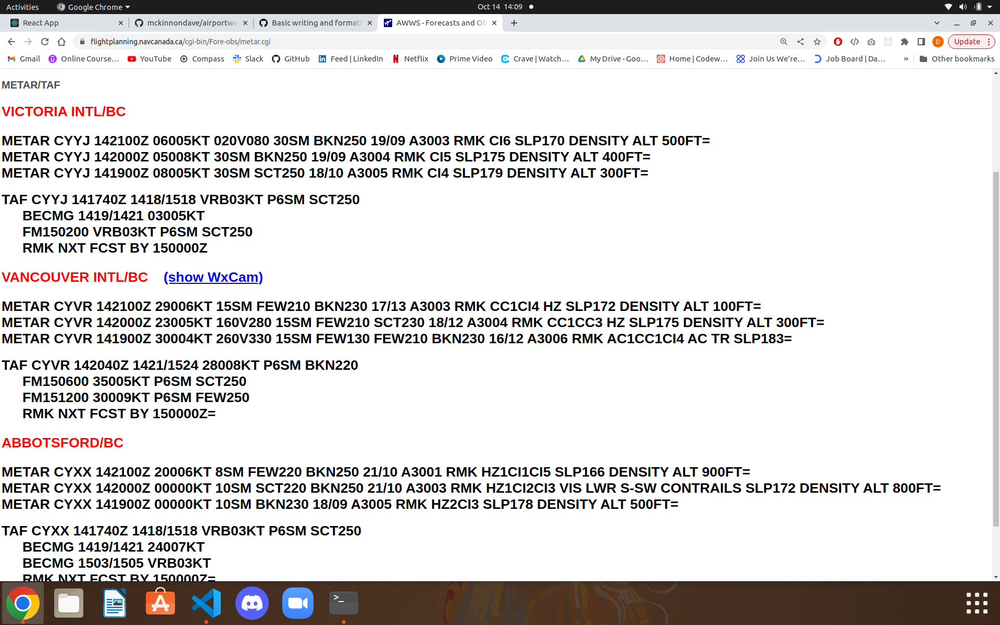

## Betterweather

### About

Betterweather is a single-page application built using React that aims to solve the issue of weather app inaccuracies. Coded weather data obtained at airports is incredibly powerful, updated consistently throughout the day, and provides pilots and air traffic controllers with more data than what the public sees to better understand and anticipate the weather around them. This app takes that information, decodes it, and presents it as something that anyone can understand.

This application is currently a **work-in-progress** and is likely to change significantly while I work through how I would like to display all my data and project layout. Below however is an example of what the project looks like as of Monday November 7, 2022.

#### Example code of what a pilot would see:

#### How betterweather is converting this info (recent weather only so far. Forecasts to come):

#### Previous Progress:
